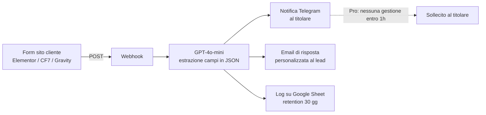

# Architettura — Sistema Risposta Rapida Lead

Filosofia (dal piano): **niente over-engineering**. Fase 1 gratuita e manuale per validare; infrastruttura propria solo dal 3° cliente ricorrente.

## Flusso del servizio

In parole: la richiesta arriva dal form → entro 60 secondi il potenziale cliente riceve una risposta personalizzata via email e il titolare riceve su Telegram nome, telefono, tipo di lavoro e urgenza.

## Fase 1 — Validazione (clienti 1–2)

| Componente | Scelta | Costo |
|---|---|---|
| Orchestrazione | **Make.com Free** (1.000 ops/mese) | €0 |
| Estrazione + bozza risposta | **GPT-4o-mini via modulo HTTP** (mai i moduli AI nativi di Make: consumano crediti multipli; la chiamata HTTP diretta = 1 credito, parsing col modulo JSON) | ~$0,06/mese per 200 lead |
| Notifica titolare | **Bot Telegram** | €0 |
| Email di risposta | SMTP del cliente o Gmail | €0 |

Guida passo-passo: [`fase1-setup-validazione.md`](fase1-setup-validazione.md). **Non attivare in fase 1**: VPS, n8n, WhatsApp Business API, domini dedicati.

## Fase 2 — Industrializzazione (dal 3° cliente)

| Componente | Scelta | Costo |
|---|---|---|
| Orchestrazione | **n8n self-hosted (Community Edition)** su Hetzner CX22, Ubuntu 24.04, Docker | €4,51/mese (totale, tutti i clienti) |
| Multi-tenancy | 1 workflow duplicato per cliente, credenziali separate per cliente | — |
| Dati | Server in Germania → **dati in UE** (coerente col DPA) | — |
| LLM | GPT-4o-mini ($0,15/$0,60 per Mtok) con **hard budget $10/mese** sulla dashboard OpenAI | ~$0,06/cliente/mese |

Runbook completo: [`runbook-n8n-hetzner.md`](runbook-n8n-hetzner.md). Template workflow: [`n8n/lead-response-v1.json`](n8n/lead-response-v1.json).

## Canali di notifica al titolare

| Canale | Quando | Costo |
|---|---|---|
| **Telegram** | **Default per tutti** — gratis, illimitato, notifica in 2 secondi | €0 |
| WhatsApp Cloud API (Meta diretto) | Solo fase 2+ e solo se il cliente lo chiede esplicitamente | €2–10/mese per cliente (50–200 notifiche) |
| SMS (Twilio) | Solo fallback raro (cliente senza smartphone-messaging) | $0,0927/msg |

## Costi per cliente e margine

| Voce | Costo/mese |
|---|---|
| LLM (200 lead × ~600 token in + ~300 out) | ~$0,06 |
| Quota VPS diluita (CX22 / n. clienti) | €0,20–1,50 |
| WhatsApp (solo se attivo) | €2–10 |
| **Totale per cliente** | **€6–13 (incluso overhead)** |

Con canone Pro €197/mese → **margine lordo ~95%**.

## Fallback LLM (solo dal mese 9+, non prima)

Rischio piattaforma OpenAI (prezzi/termini): tenere un fallback **testato una volta e documentato**, non integrato in anticipo.

- Claude Haiku ($0,80/$4 per Mtok) — stessa chiamata HTTP, cambia endpoint e formato
- Gemini Flash
- Ollama locale sul VPS (zero costi marginali, qualità da verificare sull'italiano)

## Regole di sicurezza trasversali (da DPA, vedi `02-legale-fiscale/dpa-art28-gdpr.md`)

- TLS su tutto (Caddy con Let's Encrypt)
- Credenziali separate per cliente su n8n
- 2FA su Hetzner, OpenAI, Telegram, registrar
- Backup cifrati settimanali, retention 4 settimane
- Log lead conservati max 30 giorni poi cancellati
- Rotazione chiavi API ogni 6 mesi
